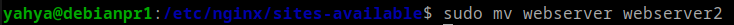
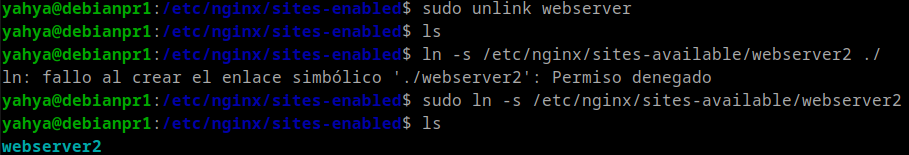
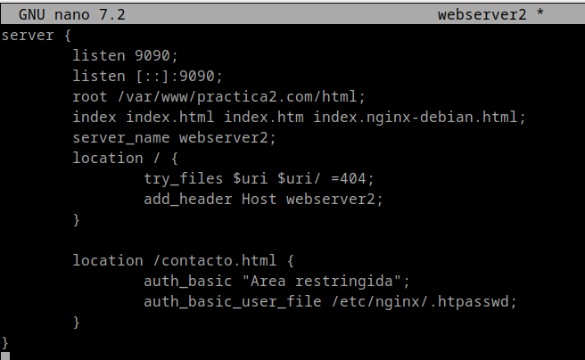
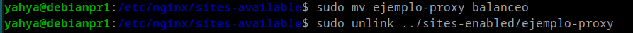
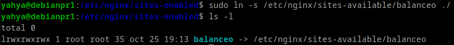
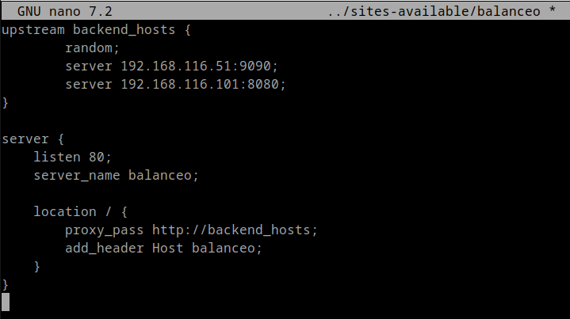
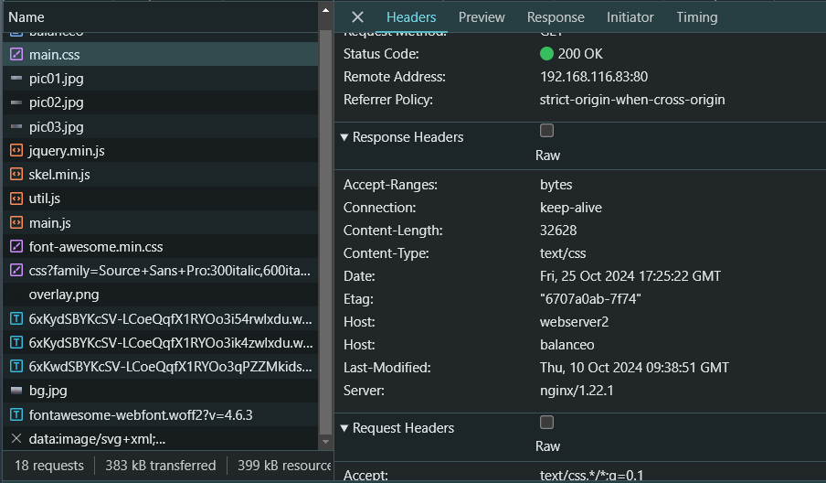
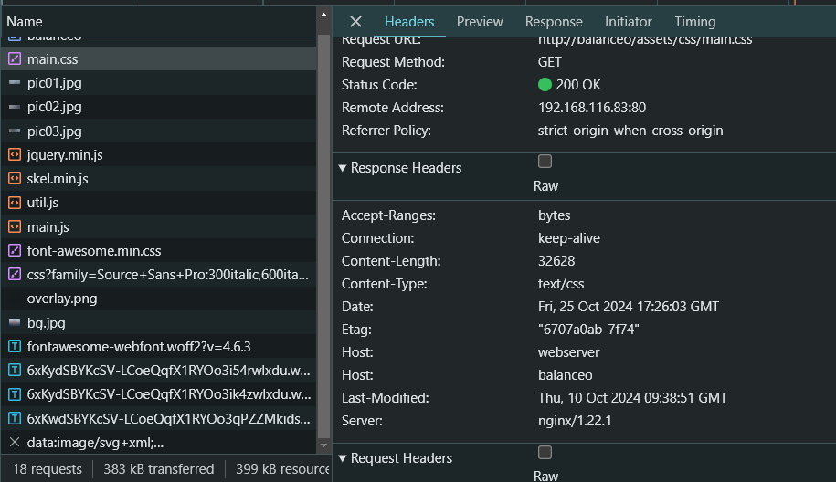

# Practica 2.4

## Introduccion
 En esta practica vamos a configurar un servidor Proxy para el balanceo de peticiones, primero clonamos la máquina de Debian donde tenemos, configurado nuestro servidor web de las prácticas anteriores, de esa forma tendremos 2 servidores web, y ademas del anterior que clonamos par el proxy.


## Ajustar el nuevo servidor web (webserver2)

### Primero vamos a cambiarle el nombre al archivo de conf en ```/etc/nginx/sites-available``` a ```webserver2``` <br>





### Luego le quitamos el link simbolico anterior y lo volvemos a crear:



### Y ahora:
* #### Verificamos la sintaxis con el comando:
        sudo nginx -t
* #### Reiniciamos el servicio de ```nginx``` con el comando:
        sudo systemctl restart nginx

### Modificamos su configuracion:

#### Le ponemos el puerto ```9090```, y la cabezera ```webserver2```




## Configurar el ```PROXY```:

### Le cambiamos el nombre a su archivo de conf en ```/etc/nginx/sites-available``` por ```balanceo``` y le quitamos el link simbolico:



### Creamos el nuevo link simbolico con el nuevo nombre y mostramos el resultado:



### Configuramos el archivo de configuracion ```balanceo``` para que pueda distribuir las peticiones **aleatoriamente**:

 <br>

- ```random```: Para elegir un server aleatoriamente de los indicados, en este caso son las IPs de webserver y webserver2.

- ```proxy_pass```: Para dirigir las peticiones a ```backend_hosts ``` que se encarga de elegir aleatoriamente uno de los servidores.

## Hosts Anfitrion
### Ahora ya ponemos la ip del ```PROXY``` en el hosts de windows que se encuentra en:
        C:\Windows\System32\drivers\etc\hosts


## Navegador

### Nos metemos en el navegador de la maquina anfitriona y hacemos una peticion al proxy de balanceo.



#### Fijamos en las cabeceras ```Host``` se aprecia que la primera indica ```webserver2```, y la segunda indica ```balanceo```. Los cuales son los que hemos puesto en la configuracion de ambos.

#### Se ve que el ```PROXY```ha dirigido la peticion aleatoriamente al ```webserver2```.


### Mandamos otra peticion al ```PROXY``` y pinchamos ```F12```.

#### Nos metemos en la seccion de ```Network``` vara visualizar las cabezeras de la respuesta.



#### Y ahora se nota que esta vez el ```PROXY``` a dirigido la peticion a ```webserver```.
